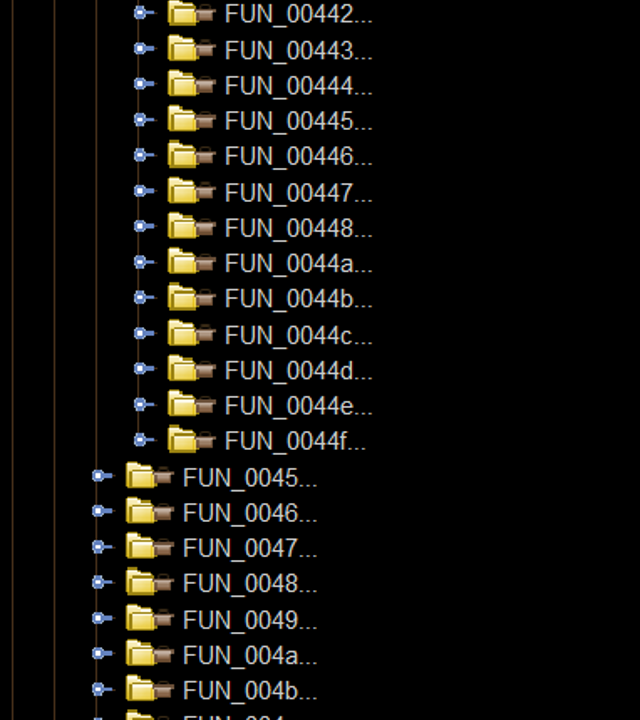
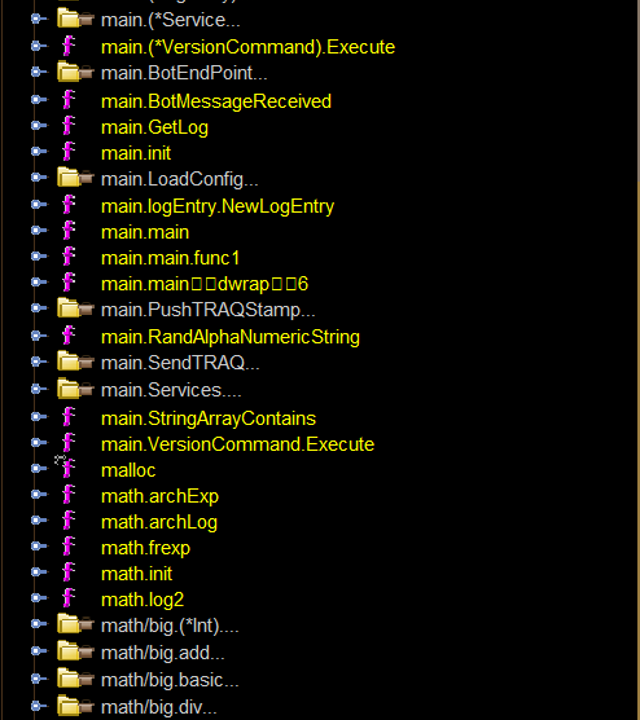

<!-- class: invert -->

# Enhance assistance for reversing Go 
## @hijiki51

---

# Background

- Go製のマルウェアが増えてきている

- 独自のランタイムを持つため、解析が正常に行われない

--- 

---

# Background

- [felberj/gotools](https://github.com/felberj/gotools)

- GhidraでのGoバイナリの解析をサポートしてくれる
    - 関数名の復元
    - 一部型の復元
    - 返り値の復元
---

# Background
## Go1.16
- pclntabの構造の変更
    - 関数アドレス、関数名等の情報を持つ
- 関数名の復元ができなくなる

---

# Background
## Go 1.17
- 関数呼び出し規約の変更
    - 引数/返り値をレジスタで扱うように
- 返り値の復元ができなくなる

---

# Goals
- 関数名を復元できるようにする
- 引数、返り値の数を特定・適用する
- 引数・返り値の型を特定・適用する

---

---

# Future Works

- 取得した引数/返り値の数の適用
- 型をGhidraで構造体として保持する
- 取得できた型の関数や変数への適用

